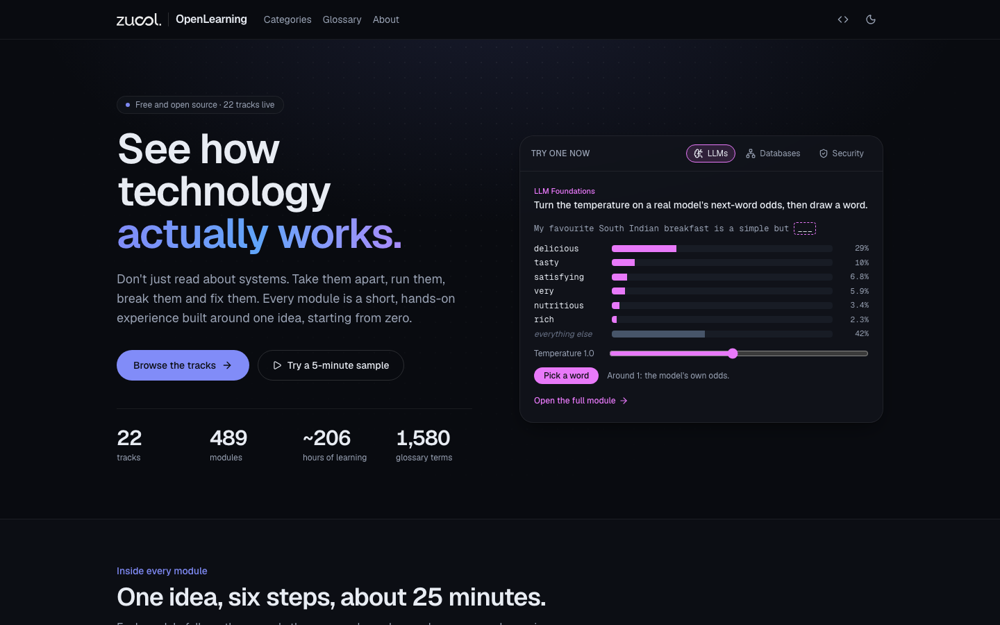

# OpenLearning

**See how technology actually works.** OpenLearning is a free, open-source collection of interactive learning tracks for software engineers. Instead of reading about a system, you take it apart, run it, break it and fix it, right in your browser.

**Start learning at [openlearning.zucol.in](https://openlearning.zucol.in).**



- **21 tracks, 467 modules, about 200 hours** of hands-on learning, from data lakehouses to application security.
- **Starts from zero.** Every module opens with an everyday story before the mechanics, and every piece of jargon links to a plain-English glossary of 1,500+ terms.
- **The format fits the idea.** 3D models, live simulations, step-throughs, build-and-connect canvases, broken systems to diagnose, and real SQL running in the browser.
- **No scores, no exams.** Checkpoints explain the reasoning behind every answer, and you can always try again.
- **Vendor-neutral.** Open standards first, then how AWS, Google Cloud, Azure and open-source tools each do it.
- **No account, no backend.** It's a static site. Progress is saved in your browser's local storage and never leaves your device.

## Tracks

| Category              | Track                                                                           | What it covers                                              | Modules |
| --------------------- | ------------------------------------------------------------------------------- | ----------------------------------------------------------- | ------: |
| Data engineering      | [Modern Data Lakehouse](https://openlearning.zucol.in/tracks/data-lakehouse)    | Open files, open tables, any engine.                        |      29 |
|                       | [Streaming Data Systems](https://openlearning.zucol.in/tracks/streaming-data)   | Data that never stops: events, logs, windows and state.     |      23 |
|                       | [Apache Spark](https://openlearning.zucol.in/tracks/spark)                      | How distributed dataframes plan, shuffle and scale.         |      21 |
|                       | [Data Modelling](https://openlearning.zucol.in/tracks/data-modelling)           | Stars, snowflakes, vaults and when to use each.             |      21 |
|                       | [Data Quality](https://openlearning.zucol.in/tracks/data-quality)               | Tests, contracts and observability for data.                |      21 |
| AI & machine learning | [LLM Foundations](https://openlearning.zucol.in/tracks/llm-foundations)         | See inside the models, not just the chat box.               |      26 |
|                       | [RAG Systems](https://openlearning.zucol.in/tracks/rag-systems)                 | Answers grounded in your documents, not the model's memory. |      23 |
|                       | [AI Agents](https://openlearning.zucol.in/tracks/ai-agents)                     | Tools, planning, memory and guardrails.                     |      21 |
|                       | [Voice AI](https://openlearning.zucol.in/tracks/voice-ai)                       | Speech in, speech out, in real time.                        |      18 |
|                       | [LLM Evaluation](https://openlearning.zucol.in/tracks/llm-evaluation)           | Measuring quality, safety and regressions.                  |      20 |
|                       | [Applied ML](https://openlearning.zucol.in/tracks/applied-ml)                   | Classic machine learning, from features to deployment.      |      22 |
| Platform & cloud      | [Cloud Architecture](https://openlearning.zucol.in/tracks/cloud-architecture)   | How cloud platforms are built, and how to design on them.   |      22 |
|                       | [Kubernetes](https://openlearning.zucol.in/tracks/kubernetes)                   | Pods, controllers and scheduling, taken apart.              |      23 |
|                       | [CI/CD](https://openlearning.zucol.in/tracks/ci-cd)                             | From commit to production, safely and often.                |      21 |
|                       | [Observability](https://openlearning.zucol.in/tracks/observability)             | Metrics, logs, traces and SLOs in depth.                    |      21 |
| Architecture          | [System Design at Scale](https://openlearning.zucol.in/tracks/system-design)    | Build systems that bend, not break.                         |      27 |
|                       | [API Design](https://openlearning.zucol.in/tracks/api-design)                   | Resources, versions, pagination and contracts.              |      21 |
|                       | [Database Internals](https://openlearning.zucol.in/tracks/database-internals)   | Pages, indexes, logs and transactions underneath SQL.       |      21 |
|                       | [Enterprise Patterns](https://openlearning.zucol.in/tracks/enterprise-patterns) | Integration, domains and boundaries in large organisations. |      21 |
| Security & government | [Application Security](https://openlearning.zucol.in/tracks/app-security)       | The common attacks, and the habits that stop them.          |      22 |
| Delivery management   | [Agile & Scrum](https://openlearning.zucol.in/tracks/agile-scrum)               | The ceremonies, and the thinking behind them.               |      23 |

More tracks are planned, including the DPDP Act, Testing, Git, Frontend, Accessibility and UX. The full roadmap is in [docs/PLAN.md](docs/PLAN.md).

## Inside a module

Every module follows the same six-step rhythm and takes about 25 minutes:

1. **The story:** an everyday analogy that gives you the big idea.
2. **The centrepiece:** one interactive you drive yourself.
3. **Two explorations:** variations and edge cases that show where the idea bends and breaks.
4. **A checkpoint:** predict or explain, with the reasoning shown for every answer.
5. **The wrap-up:** what to remember, the terms you met and where to go next.

Each module folder also holds a `SOURCES.md` that lists the primary sources its claims were checked against, and a `STORYBOARD.md` that explains its design.

## Running it locally

You need Node.js 20 or later and [pnpm](https://pnpm.io) 9.

```bash
pnpm install
pnpm dev          # http://localhost:3000
pnpm build        # static site in out/, ready for any static host
```

Checks:

```bash
pnpm typecheck && pnpm lint
pnpm test:e2e     # Playwright smoke tests (first time: pnpm exec playwright install chromium)
```

## How the code is organised

| Path                  | What lives there                                                                            |
| --------------------- | ------------------------------------------------------------------------------------------- |
| `catalogue.ts`        | The source of truth for categories, tracks, chapters and modules.                           |
| `modules/<track>/`    | One folder per module: `index.tsx`, `steps.tsx`, `model.ts` (pure logic), `state.ts`, docs. |
| `modules/registry.ts` | Maps each live module to its lazily loaded component.                                       |
| `lib/module-sdk.tsx`  | The only API a module uses for steps, progress and checkpoints.                             |
| `toolkit/`            | Shared building blocks: the step shell, checkpoints, controls, builders and 3D helpers.     |
| `glossaries/`         | One glossary per track, plus a small shared core.                                           |
| `components/`         | Site chrome, track and category pages, card art and the animated home/track showcases.      |
| `docs/PLAN.md`        | Design language, architecture, curriculum and roadmap.                                      |

Built with [Next.js](https://nextjs.org) (static export), React 19, Tailwind CSS 4, [Motion](https://motion.dev), React Three Fiber, DuckDB-WASM and Transformers.js-generated model data. Heavy libraries load only inside the modules that need them.

## Contributing

Corrections and ideas are very welcome. If you spot a factual error, please open an issue that links a primary source. Before you open a pull request, read the conventions in [CLAUDE.md](CLAUDE.md) and the "Designing for newcomers" section of [docs/PLAN.md](docs/PLAN.md). In short:

- Modules talk only to the Module SDK, never to storage directly.
- Use colour tokens rather than raw colour values; `viz-*` colours have fixed meanings.
- Write for newcomers: open with an analogy, and wrap jargon in `<Term>` with a glossary entry.
- No gamification: no scores, points, badges or certificates.
- Security content uses rules-based, in-browser simulations only. Describe attack inputs in words; never include working payloads.
- Run `pnpm typecheck && pnpm lint && pnpm test:e2e` and check your change in dark, light and mobile layouts.

## Credits

Built by the engineering team at Zucol Services. Some modules quote third-party material under its own licence, for example the Scrum Guide (CC BY-SA 4.0); each module's `SOURCES.md` gives the attribution.

## Licence

The code and original content are released under the [MIT License](LICENSE). The Zucol name and logos are not covered, and third-party material quoted in the modules (such as the Scrum Guide, under CC BY-SA 4.0) stays under its own licence; see [LICENSE](LICENSE) for the details.
